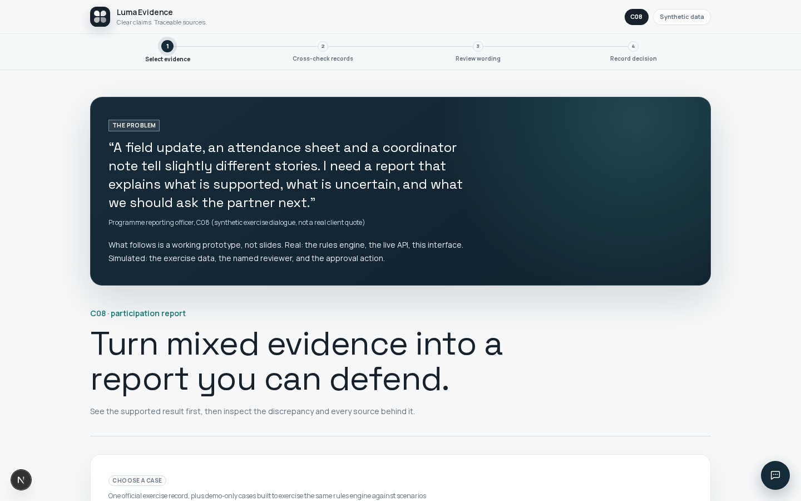
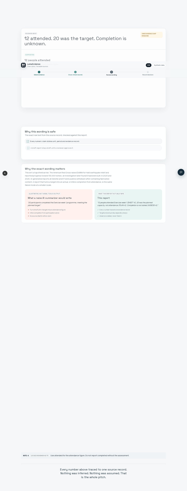
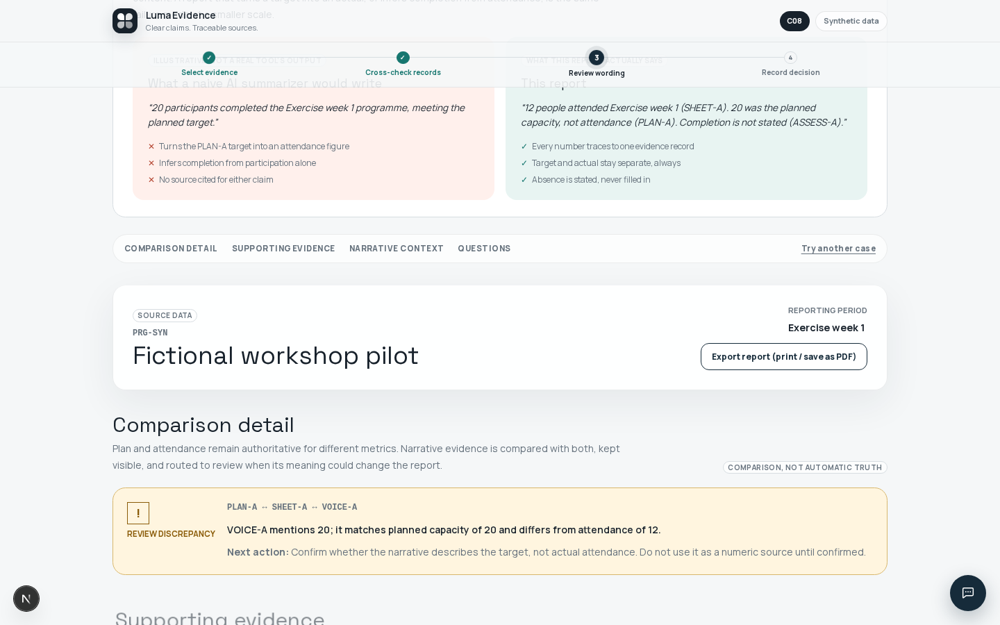
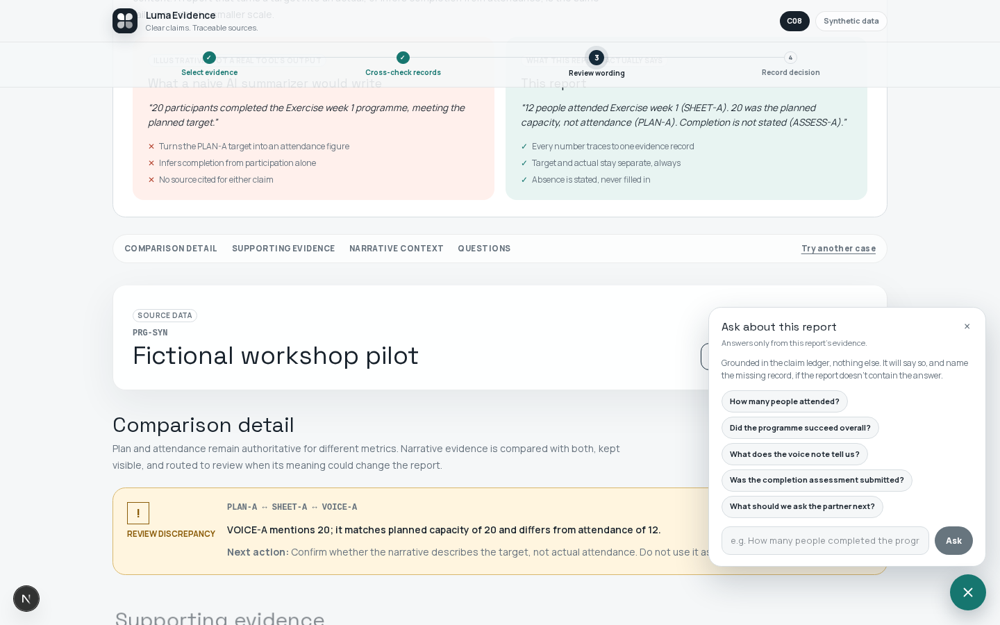

# Octopus Day — C08 Evidence Report Desk

*Luma Evidence — clear claims, traceable sources.*

A solo 6-hour hackathon build (Octopus Day 2026-09-17). **Result: 5th place.**

## Problem

A programme reporting officer must reconcile a plan target, attendance register, narrative update, and possibly-missing assessment — without turning uncertain evidence into a reportable fact. Deadline pressure pushes toward reporting whichever number looks best, or quietly treating a target as an actual, or claiming completion nobody verified. The consequence: a report a funder later can't trust.

## Approach

A result-first, evidence-linked report desk, not an LLM summarizer:

- **Targets stay separate from attendance.** A plan figure never becomes a reported actual.
- **Narrative evidence (voice notes, field notes) stays visible but non-authoritative.** It can corroborate or flag a discrepancy against the plan/attendance numbers — it never becomes a numeric citation.
- **Completion is never inferred.** If the assessment record is missing, the report says so explicitly ("not stated, see source assessment record"), not a blank and not a guess.
- **Every number cites its source evidence record.** No number appears without traceability.
- **Approval is a status action only.** A named reviewer approves or sends back with a reason; that action never alters a generated claim. All actions append to a visible, append-only history.

### The logic in one picture

```
plan.json, sheet.json,      →  evidence classified by TYPE          →  claim ledger
voice-note.json, assess.json    (attendance / plan / assessment        (each claim cites
                                  = authoritative; everything else       exactly one
                                  = narrative, excluded from             evidence_id)
                                  numeric claims)
                                        │
                                        ├─ clean text, exactly one digit-run
                                        │    → deterministic read, HIGH confidence
                                        │
                                        ├─ zero or multiple digit-runs
                                        │    → one DeepSeek call, LOW confidence,
                                        │      labeled "AI-assisted, low confidence"
                                        │      (fallback: fixed known-ID lookup)
                                        │
                                        └─ narrative (voice note, field note)
                                             → deterministic cross-check vs.
                                               plan + attendance, flagged
                                               needs-review, NEVER a citation
                                        │
                                        ▼
                          reviewer brief (leads with the decision) → approve / send back
                          (status only — claims never change) → append-only history
```

Deterministic rules do the claim construction (`backend/app/rules/c08_report.py`). The only LLM call in that path handles the genuinely ambiguous minority of records (zero or multiple digit-runs in one field) and is explicitly labeled low-confidence in the UI — it is never used for the clean-text majority. A second, fully separate DeepSeek endpoint answers free-text questions about an already-computed report, must cite an `evidence_id` per factual claim, and refuses rather than guesses when the report doesn't say something (`backend/app/routers/c08_ask.py`); it has no path back into claim construction.

## Tech stack

- Backend: FastAPI + deterministic Python rules + DeepSeek for disclosed ambiguous extraction and report Q&A
- Frontend: Next.js + Tailwind CSS

## How to run

```bash
# Backend — http://localhost:8461
cd backend && uv sync && ./dev.sh

# Frontend — http://localhost:4927/c08
cd frontend && npm run dev
```

Demo cases available from the case selector: `PRG-SYN` (official record), `PRG-NOASSESS` (missing assessment), `PRG-DOUBLE` (two ambiguous narrative records), `PRG-BULK` (full 12-week, 17-record, 8-evidence-type case).

## Screenshots

**1 — Case selection, the client quote framing the problem**


**2 — Reviewer brief: leads with the decision, not the machinery**


**3 — Three-source cross-check, flagging a discrepancy without citing it as a number**


**4 — "Ask about this report": grounded Q&A, cites evidence_id, refuses to guess**


## What's built vs. what's next

Built end-to-end: deterministic report construction, source-linked claims, three-source cross-checks, explicit unknown completion state, partner follow-up questions, simulated human review with visible history, demo-only variation cases, grounded report Q&A, and print/PDF export.

Simulated or deferred: source ingestion, authentication, durable persistence, real reviewer identity, external publication, and production document extraction. The next validation is an 8–12-pack consented, redacted sample reviewed independently by two programme officers.

## Wolf handoff

Full handoff — problem validated, what's real vs. simulated, required client integration, data boundary, failure/recovery plan: [`octopus-candidate-pack/C08/WOLF_HANDOFF.md`](octopus-candidate-pack/C08/WOLF_HANDOFF.md).

See also: [C08 build guide](octopus-candidate-pack/C08/BUILD.md), [data-readiness plan](octopus-candidate-pack/C08/DATA_READINESS.md), and [presentation script](octopus-candidate-pack/PRESENTATION_SCRIPT.md).
